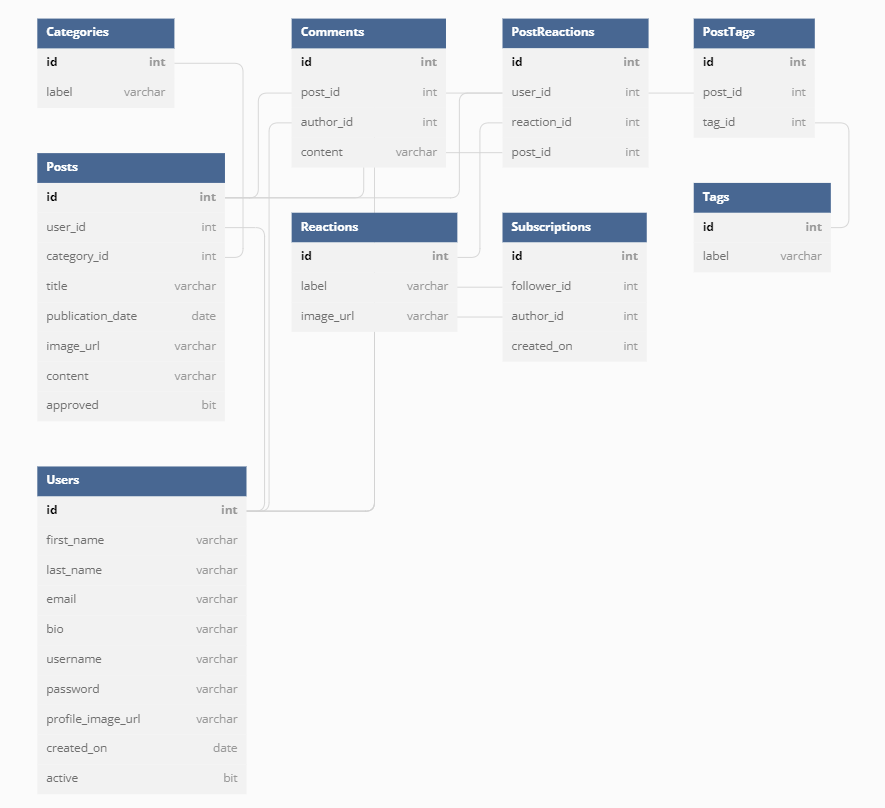

# Rare Server
<!-- TODO: Add a description of the Rare application -->
Full Stack Group Project where tasked to create a blogging platform, where writers can create, edit, and delete posts. In addition to the posts, tags, comments, and a category can be assigned to the post. 

Server side of the project is using Python and SQL.

## Getting Started:
1. Clone the repository: `git clone git@github.com:vickitaylor/rare-server-spanish-inquisition-v.git`
2. `cd rare-server-spanish-inquisition-v`
3. Run `pipenv install` to install the dependencies
4. Run `pipenv shell` to start the virtual environment
5. Create a `db.sqlite3` file
6. Add a connection to the database file
7. Run the commands in the `loaddata.sql` file to create the tables in the database
<!-- TODO: As more of the project is filled in add the other steps to get this project running -->

## Link to Client Side of the Project
https://github.com/vickitaylor/rare-client-spanish-inquisition-v

## ERD 

## Contributors
* Danielle Martin
    * Worked on the post module. 
* Griffin Moyer
    * Worked on the post, categories, and tags modules.
* Rose Cota
    * Worked on the post, user, and comments modules. 
* Stacy Lofton
    * Worked on the post and comments modules. 
* Vicki Taylor
    * Worked on the categories, tags, login, and comments modules. 